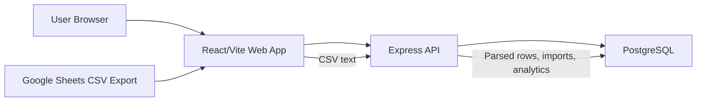
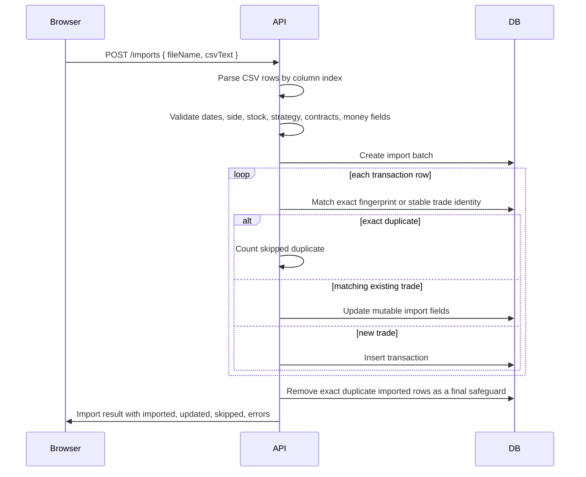

# Trade Journal Architecture

## High-Level Shape



Trade Journal is a Dockerized single-user web application. The frontend renders the trading journal UI, the API owns import and analytics behavior, and PostgreSQL stores transactions, import batches, daily reviews, and backup-restorable state.

## Runtime Services

`docker-compose.yml` defines three services:

- `postgres`: PostgreSQL 16 with persistent `postgres-data`
- `api`: Node/Express TypeScript API running on container port `4000`, published to host port `4000`
- `web`: Vite dev server published to host port `5173`

The app is LAN-accessible because Docker publishes the web and API ports on `0.0.0.0`.

## Frontend

The frontend lives in `apps/web`.

Key modules:

- `src/App.tsx`: top-level navigation and drilldown routing state
- `src/lib/api.ts`: typed fetch client for every API endpoint
- `src/components/FilterBar.tsx`: global filters, saved views, date presets
- `src/pages/DashboardPage.tsx`: dashboard analytics, charts, rankings, diagnostics
- `src/pages/TransactionsPage.tsx`: transaction table and editor drawer
- `src/pages/OpenPositionsPage.tsx`: open positions view
- `src/pages/PositionsPage.tsx`: grouped position lifecycle view
- `src/pages/DailyReviewPage.tsx`: calendar-day drilldown, notes, chart attachment
- `src/pages/ImportsPage.tsx`: CSV import, backup export, restore
- `src/pages/CleanupPage.tsx`: stock/strategy/group cleanup tools

The web app calls the API through `apps/web/src/lib/api.ts`. When accessed from another computer on the LAN, the API URL is resolved from `window.location.hostname` so the remote browser does not try to call its own `localhost`.

## API

The API lives in `apps/api`.

Route modules:

- `routes/health.ts`: database health check
- `routes/transactions.ts`: list, create, update, delete transactions and open positions
- `routes/analytics.ts`: dashboard, stock, and strategy analytics
- `routes/imports.ts`: CSV import and import history
- `routes/positions.ts`: grouped position lifecycle endpoints
- `routes/daily-reviews.ts`: calendar-day review read/write
- `routes/cleanup.ts`: strategy/stock rename and position group assignment
- `routes/backup.ts`: JSON backup export and restore

Service modules:

- `lib/csv-import.ts`: CSV parsing, validation, dedupe/update import behavior
- `lib/analytics-service.ts`: P&L summaries, time buckets, drawdown, diagnostics, rankings
- `lib/transactions-service.ts`: transaction CRUD
- `lib/positions-service.ts`: position grouping and lifecycle analytics
- `lib/daily-reviews-service.ts`: day-level notes and chart images
- `lib/backup-service.ts`: full JSON export/restore
- `lib/migrations.ts`: lightweight startup schema additions
- `lib/db.ts`: PostgreSQL pool and query helper

## Database

Initial schema is in `docker/postgres/init.sql`. Startup migrations in `apps/api/src/lib/migrations.ts` add newer columns/tables to existing databases.

Main tables:

- `transactions`: imported and manually created trades
- `import_batches`: CSV import history
- `daily_reviews`: per-day notes and chart image data URLs

Important transaction fields:

- Imported trade fields: open date, expiration, close date, stock, side, strategy, strikes, contracts, prices, fees, profit, win/loss, bot/manual, notes
- Review fields: tags, review notes, lesson learned, exit reason
- Risk fields: profit target, stop loss, max risk
- Grouping fields: position group and derived position-group fallback

## CSV Import Flow



Stable import identity currently uses open date, expiration, stock, side, strategy, strikes, contracts, opening price, broker, and bot/manual. Mutable fields such as close date, closing price, fees, profit, win/loss, and notes can update on re-import.

## Analytics Rules

- Realized P&L includes only closed trades with `closeDate` and `profit`.
- Open positions remain visible but are excluded from realized totals.
- The imported `profit` field is authoritative.
- Daily, weekly, monthly, and yearly buckets group by `closeDate`.
- Bot/manual, long/short, stock, strategy, and status filters are applied before analytics are built.

Dashboard analytics include:

- Summary cards
- Daily/weekly/monthly/yearly realized views
- Equity curve
- Drawdown
- Calendar heatmap
- Strategy ranking
- Stock breakdown
- Bot vs manual comparison
- Day-of-week breakdown
- Holding-period scatter data
- Win/loss streaks
- Best/worst trades and outlier impact

## Backup And Restore

`GET /backup` exports:

- Import batches
- Transactions
- Daily reviews
- Client saved views are added by the browser before download

`POST /backup/restore` replaces the current journal data with the uploaded backup payload. This is intentionally broad and should be treated as destructive.

## Testing

Current automated tests focus on the frontend API client:

- URL construction
- Query string behavior
- Method and JSON body for mutations
- Route encoding
- Error handling
- API base URL override behavior

Run with:

```bash
npm test
```

Verification for larger changes should also include:

```bash
npm run typecheck
npm run build
docker compose up -d --build api web
curl -I http://127.0.0.1:5173
```

